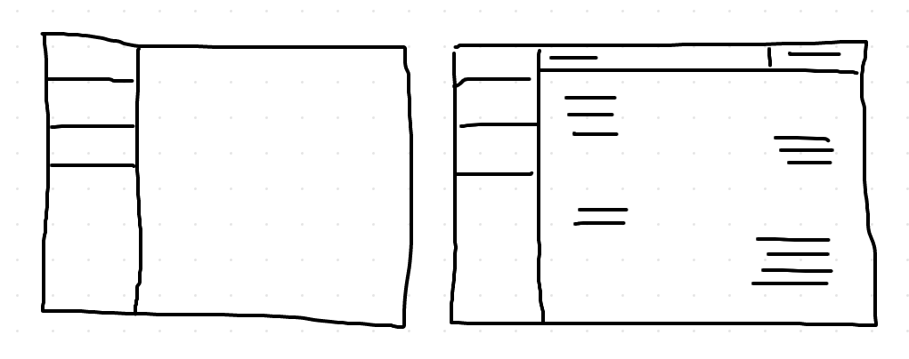

# Mediquo Frontend Test
Our team has been assigned with a task to create a tool for the Quality Service Team. In order to ensure the quality and professionality of our service, this team will review every interaction that has been flagged in our chat and review it. This team needs a chat shell, that has a list of chats to review, can view the conversation detail of each one of them, and can perform an OK/KO action (locally).

## Goal
As a Quality Service member I want to review the interactions that have been flagged in order to ensure the quality of the service.

## Setup
- The list of chats to review can be found here: https://github.com/mediquo/frontend_test/blob/master/json/list.json
- The detail of each chat can be found on messages key inside each room.

## Requirements
- It should have a layout of a chat shell.
- A list of chats on the left and the detail of the conversation on the middle.
- The list of chats has to be sorted by most recent on top.
- The chat list item has to display the name, avatar and date.
- If no chat has been selected, there is an empty screen on the middle section.
- When a user selects a chat, the conversation loads on the middle section.
- Professional messages are on the right, Patient messages are on the left.
- When a chat is selected the middle section has a header with the user name and the review status select.
- The review status select can be Good, Bad or Not Reviewed.
- The sidebar has to be accurate with the design provided, the rest is up to you as long as the layout structure is met.

### Sidebar
The sidebar has to respect the given design. 

### Chat Shell
It contains two sections, the left sidebar and the middle content section.

## Finishing
When your solution is complete, please send us back a git repository with your code to roger.cendros@mediquo.com and david.llort@mediquo.com

## Tips
Take your time, this is a test, so try your best to make the code as readable and understandable as possible. This is a simplification of a larger problem, take that in mind when proposing an architecture for the solution.
